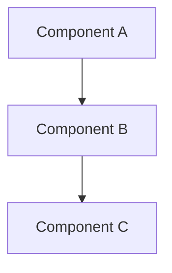

# Document Topic

## Step 1: Find Git Root

Run `git rev-parse --show-toplevel` to locate the repository root.

## Step 2: Understand the Topic

The topic to document is: $ARGUMENTS

If no topic provided, ask the user what they want documented.

## Step 3: Explore the Codebase

Launch a thorough exploration to understand the topic:
- Search for relevant files and patterns
- Read key implementation files
- Understand the architecture and flow
- Note important details, gotchas, and decisions

## Step 4: Create Documentation

**Naming convention**: `<topic>.md` (kebab-case)

Examples:
- `inbound-agent-architecture.md`
- `sampling-strategies.md`
- `authentication-flow.md`

Write the documentation to `<git-root>/.sessions/docs/<topic>.md`

Structure the documentation with:
- **Overview**: What this is and why it exists
- **Architecture**: How it's structured (use mermaid diagrams for complex flows)
- **Key Files**: Important files and their roles
- **How It Works**: Flow and behavior
- **Usage Examples**: How to use/modify it
- **Gotchas**: Things to watch out for
- **Related**: Links to related docs or code

Use this template:
```markdown
# [TOPIC]

## Overview

[What this is and why it exists]

## Architecture

[How it's structured]



## Key Files

| File | Purpose |
|------|---------|
| `path/to/file.ts` | [Description] |
| `path/to/other.ts` | [Description] |

## How It Works

[Step-by-step flow and behavior]

## Usage Examples

[Code examples, CLI commands, etc.]

## Gotchas

- [Thing to watch out for]
- [Common mistake]

## Related

- [Link to related doc](other-doc.md)
- [Code reference]: `path/to/file.ts`
```

## Step 5: Link to Session Context

Add a reference to the doc in `<git-root>/.sessions/index.md` under Key Resources or Notes.

## Step 6: Confirm

Summarize what was documented and ask if the user wants:
- More detail on any section
- Related topics documented
- To proceed with other work
